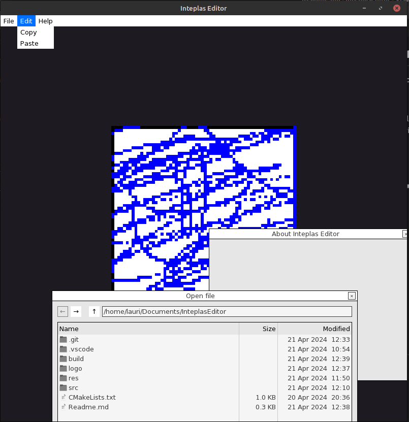

# Inteplas Editor

Inteplas Editor is the official tool for creating inteplas assets.

Why use Inteplas Editor?

+ Contains all material colors from inteplas, so creating assets is easier.
+ Support for additional rigidbodies 

Libraries:

